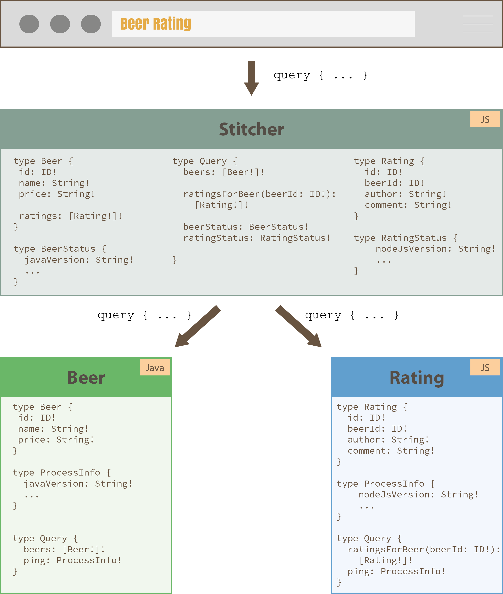

# Example: Schema Stitching with Apollo GraphQL

In this example two GraphQL schemas are stitched together to provide a single, consolidated view for the Client.

* App 1 (Java, Spring Boot, graphql-java-tools): Beer
* App 2 (JS/TS, graphql-tools): Rating

Using the schema stitching both schemas are merged together, linked together (Beer gets a direct link to its Ratings) and exposed via one endpoint.



# Running the example

## Beer Backend

(Make sure you have Java 8 installed)

```
cd backend-beer
./gradlew bootRun
```

* GraphQL endpoint: `http://localhost:9010/graphql`
* GraphiQL Explorer: `http://localhost:9010/graphiql`

## Rating Backend
```
cd backend-rating
yarn install
yarn start
```

(you can also use `npm` but I've tested with `yarn`)

* GraphQL endpoint: `http://localhost:9020/graphql`
* GraphiQL Explorer: `http://localhost:9020/graphiql`


## Schema Stitcher

This process merges the GraphQL APIs from the `Beer` and the `Rating` backend together and exposes a single schema for the client.

```
cd schema-stitcher
yarn install
yarn start
```

* GraphQL endpoint: `http://localhost:9000/graphql`
* GraphiQL Explorer: `http://localhost:9000/graphiql`

## Frontend

The example frontend is built using TypeScript, React and Apollo React. It consumes the API from the stitcher.

```
cd frontend
yarn install
yarn start
```

* URL: `http://localhost:9080`

